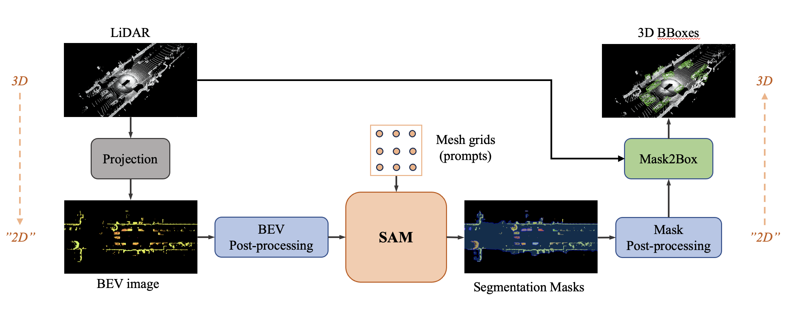

# SAM3D: Zero-Shot 3D Object Detection via Segment Anything Model

<div align=center>

</div>

## Motivation of this project
With the development of large language models, many remarkable linguistic systems like ChatGPT have thrived and achieved astonishing success on many tasks, showing the incredible power of foundation models. In the spirit of unleashing the capability of foundation models on vision tasks, the Segment Anything Model (SAM), a vision foundation model for image segmentation, has been proposed recently and presents strong zero-shot ability on many downstream 2D tasks. However, whether SAM can be adapted to 3D vision tasks is still unknown, especially 3D object detection. 

## What we do in this project
We explore adapting the zero-shot ability of SAM to 3D object detection in this project, and the project is still in progress.



## Installation
We use `pytorch==1.12.1, cuda==11.3`. We build this project based on [MMDetection3D](https://github.com/open-mmlab/mmdetection3d) (ver. 1.1.0rc3) and [segment-anything](https://github.com/facebookresearch/segment-anything) (commit 6fdee8f).

1. install waymo-open-dataset: 
    ```
    pip install waymo-open-dataset-tf-2-6-0
    ```
2. install MMDetection3D: 
   ```
    pip install -U openmim
    mim install 'mmengine==0.7.2'
    mim install 'mmcv==2.0.0'
    mim install 'mmdet==3.0.0'

    git clone https://github.com/open-mmlab/mmdetection3d.git
    cd mmdetection3d
    git checkout 341ff99  # mmdet3d 1.1.0rc3
    pip install -v -e .
   ```
3. install segment-anything:
   ```
   pip install git+https://github.com/facebookresearch/segment-anything.git
   ```
4. install other dependices: 
    ```
    pip install -r requirements.txt
    ```

## Data preparation
Since our project explores the _zero shot_ setting, we do not need to pre-process the training data. We rougly follow the data preparation set up in [MMDetection3D Data Preparation Guide](https://github.com/open-mmlab/mmdetection3d/blob/main/docs/en/user_guides/dataset_prepare.md) but do some minor modifications.

1. organize the raw data like:
   ```
    .
    └── data
        └── waymo
            └── waymo_format
                └── validation
                    └── *.tfrecord
                └── gt.bin (optional)
   ```
2. run command:
   ```
   CUDA_VISIBLE_DEVICES=-1 python tools/create_data.py waymo --root-path ./data/waymo/ --out-dir ./data/waymo/ --workers 128 --extra-tag waymo
   ```
    Note: Since evaluation on waymo dataset needs the [ground truth bin](https://console.cloud.google.com/storage/browser/waymo_open_dataset_v_1_2_0/validation/ground_truth_objects) file for validation set, you need to put the `.bin` file into `data/waymo/waymo_format`. If you do not have the access to it, you can add `--gen-gt-bin` argument to the above command:
    ```
    CUDA_VISIBLE_DEVICES=-1 python tools/create_data.py waymo --root-path ./data/waymo/ --out-dir ./data/waymo/ --workers 128 --extra-tag waymo --gen-gt-bin
    ```
    this will automatically generate `gt.bin` file (may different from the official version in some respects) into `data/waymo/waymo_format`.
3. after the pre-processing, the data folder will be organized as:
   ```
   .
    └── data
        └── waymo
            ├── kitti_format
            │   ├── ImageSets
            │   ├── training
            │   └── waymo_infos_val.pkl
            └── waymo_format
                ├── gt.bin
                └── validation
   ```
### Partial validation set preparation
Because it's time-consuming to evaluate on the whole waymo validation set, we modify the `create_data.py` to support pre-processing partial validation set. You can put any number of  `*.tfrecord`  into `data/waymo/waymo_format/validation/` and run command above, it will automatically generate the `ImageSets/val.txt` and corresponding `gt.bin`.

## Inference
### Pre-trained weights
We use the pre-trained SAM in our project, so go to [segment-anything model checkpoints](https://github.com/facebookresearch/segment-anything#model-checkpoints) to download weights and put them into `projects/pretrain_weights`.

### Zero-shot inference
1. generate the fake weights for loading (only a trick to run the `test.py` with a fake weights, and only need to run once).
   ```
   python projects/generate_fake_pth.py
   ```  
2. run the command to inference and evaluate the method:
    ```
    python tools/test.py projects/configs/sam3d_intensity_bev_waymo_car.py fake.pth 
    ```

### Results
- Quantitative results:
Tested on single NVIDIA GeForce RTX 4090 with `pytorch==1.12.1, cuda==11.3`, [log](./logs/20230517_101842.log)

    | Metric | mAP | mAPH |
    | ------ | ------- | ------- |
    | RANGE_TYPE_VEHICLE_[0, 30)_LEVEL_1| 0.195088 | 0.133009 |
    |RANGE_TYPE_VEHICLE_[0, 30)_LEVEL_2| 0.190502 | 0.129827 |

- Qualitative results: 


## What's next
Although our method is only an __initial attempt__, we believe it shows the great possibility and opportunity to unleash the potential of foundation models like SAM on 3D vision tasks, especially on 3D object detection. With technologies like __few-shot learning__ and __prompt engineering__, we can take advantage of vision foundation models more effectively to better solve 3D tasks, especially considering the vast difference between scales of 2D and 3D data.

##  Acknowledgement
- [MMDetection3D](https://github.com/open-mmlab/mmdetection3d)
- [segment-anything](https://github.com/facebookresearch/segment-anything)
- [OCR-SAM](https://github.com/yeungchenwa/OCR-SAM)
